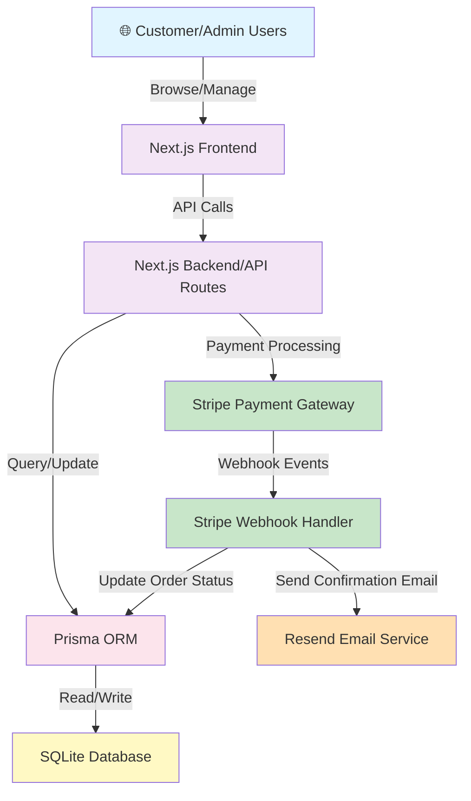
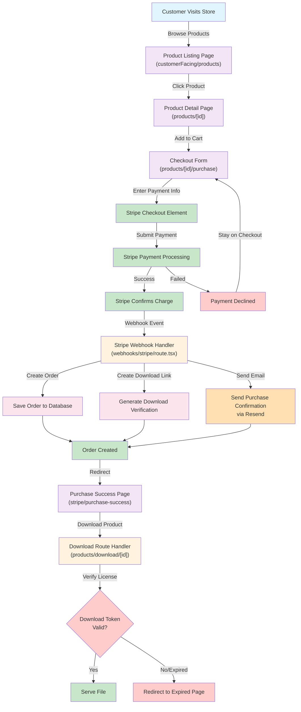
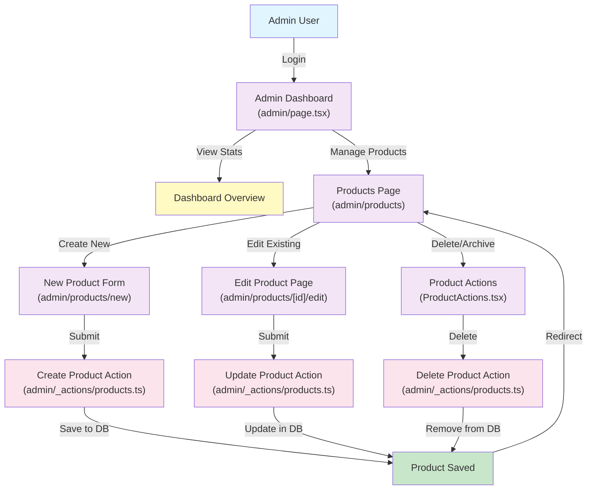
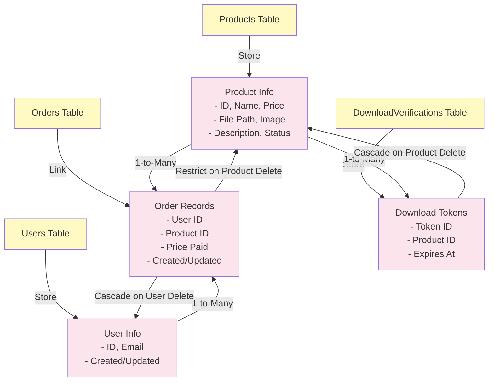
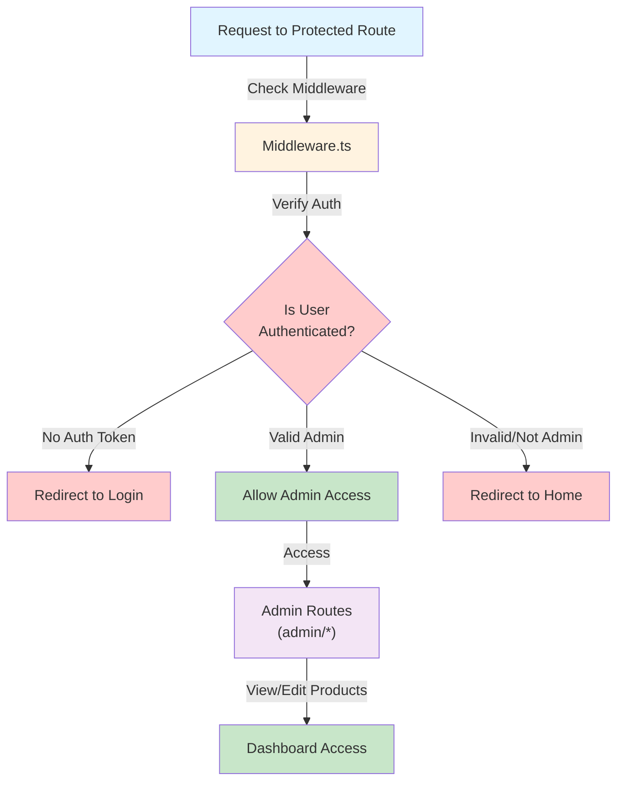
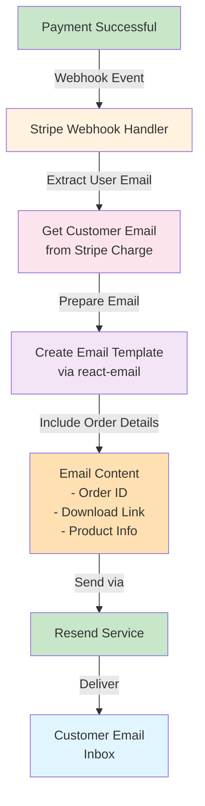
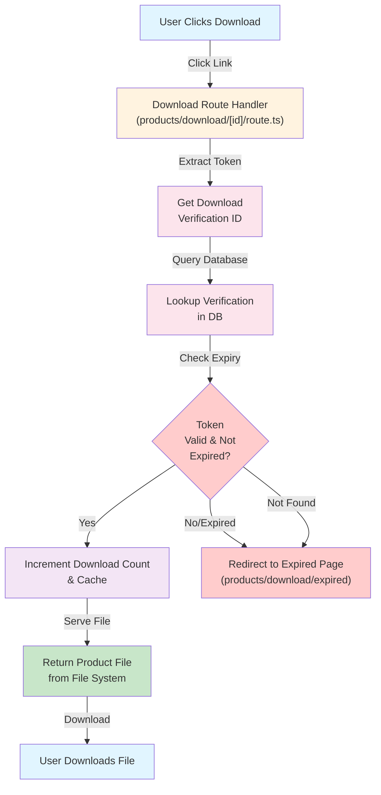

# Ecommerce Store - Application Flowchart

## Overall System Architecture



---

## 1. Customer Purchase Flow



---

## 2. Admin Dashboard Flow



---

## 3. Database & Data Model Flow



---

## 4. Authentication & Authorization Flow



---

## 5. Email Notification Flow



---

## 6. File Download & Verification Flow



---

## Key Components & File Structure

### Frontend Components (`src/components/`)
- **Nav.tsx**: Navigation bar with links
- **ProductCard.tsx**: Product display card
- **UI Components**: Button, Input, Label, Card, Table, Dropdown, Textarea

### API Routes & Actions
- **webhooks/stripe/route.tsx**: Handles Stripe webhook events
- **actions/orders.tsx**: Order management actions
- **admin/_actions/products.ts**: Product CRUD operations

### Pages & Routes
- **(customerFacing)/page.tsx**: Home page
- **(customerFacing)/products/page.tsx**: Product listing
- **(customerFacing)/products/[id]/purchase/page.tsx**: Checkout
- **admin/page.tsx**: Admin dashboard
- **admin/products/**: Product management

### Database & Utilities
- **db/db.ts**: Prisma client instance
- **lib/cache.ts**: Caching logic
- **lib/isValidAuth.ts**: Authentication validation
- **lib/formaters.ts**: Data formatting utilities
- **middleware.ts**: Request middleware for auth checks

---

## Data Flow Summary

```
Customer Journey:
Browse Products → Select Product → Add to Cart → Checkout → 
Stripe Payment → Webhook Confirmation → Database Update → 
Email Sent → Download Link Created → User Downloads File

Admin Journey:
Login → Dashboard → Product Management → Create/Edit/Delete → 
Database Update → Products Updated on Frontend

Security:
All requests → Middleware Auth Check → 
Routes require valid token/session → Protected admin routes
```

---

## Technology Stack

| Layer | Technology |
|-------|------------|
| **Frontend** | React 19, Next.js 15, TailwindCSS |
| **Backend** | Next.js API Routes, TypeScript |
| **Database** | Prisma ORM, SQLite |
| **Payments** | Stripe API |
| **Emails** | Resend, react-email |
| **UI Components** | Radix UI, Lucide Icons |
| **Validation** | Zod |

